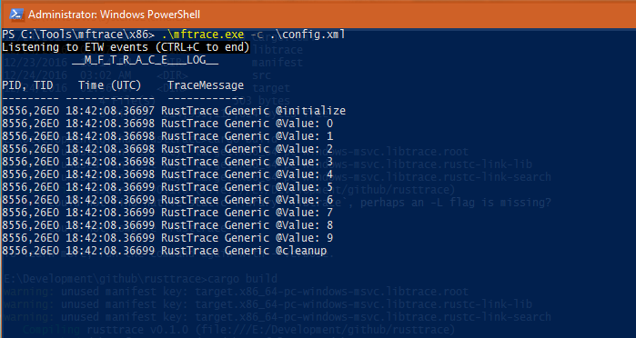
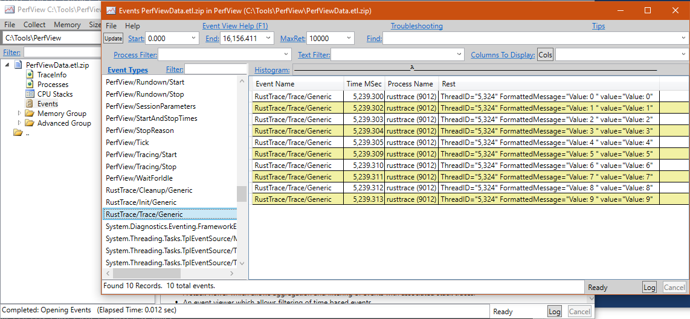
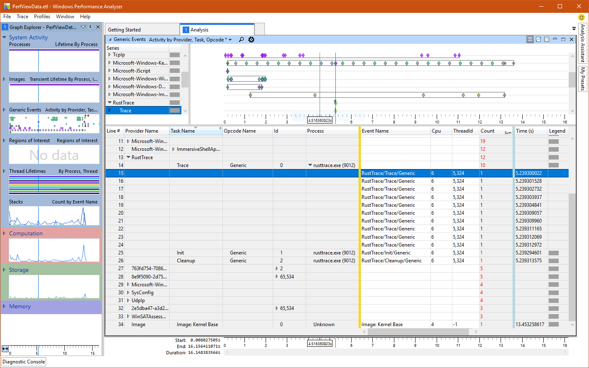

# Overview

This library provides Rust bindings to ETW event call APIs generated from an [ETW manifest file](./manifest/rtrace.man). Currently, three functions are provided in the manifest for reference: [`__rt_trace`, `__rt_init`, and `__rt_cleanup`](./libtrace/libtrace/exports.def). These functions are then exposed in [`libtrace.dll`](./libtrace/libtrace/libtrace.cpp) to be called in Rust.

# Setup

### Install the manifest file

A simple [manifest file](./manifest/rtrace.man) is provided. For more information on how to create the manifest file, check out this [link](https://msdn.microsoft.com/en-us/library/windows/desktop/dd996930(v=vs.85).aspx). To install the manifest file, run the following command in administrator mode:

```
wevtutil im rtrace.man /rf:"<full_path_to_libtrace.dll>" /mf:"<full_path_to_libtrace.dll>"
```

The header file [`rtrace.h`](./manifest/rtrace.h) was generated using `mc.exe` using the command `mc.exe -um rtrace.man`. This header file is then used in `libtrace.dll`.

`libtrace.dll` is written in Visual Studio 2015. The ETW provider registration/deregistration is done during dll load/unload events. Pre-built binaries are already provided in the `bin` folder.

### Build the test binary

A `main.rs` is provided alongside `lib.rs` for testing. To build, just run `cargo build` in the root folder. This should generate a `rusttrace.exe` binary in `target/debug` folder.

### Real-time event capture

For real-time log capture, I usually use [`mftrace.exe`](https://msdn.microsoft.com/en-us/library/windows/desktop/ff685370(v=vs.85).aspx). You can find this tool from the Windows SDK bin folder (usually in `C:\Program Files (x86)\Windows Kits\10\bin\x86`). Note that this tool needs `mfdetours.dll` as well, in case you copy it to a different location. To start capture, run the following command in either command prompt or Powershell in administrator mode:

```
mftrace.exe -c config.xml
```

*** [`config.xml`](./manifest/config.xml) is also provided.



### Using [PerfView](https://github.com/Microsoft/perfview)

For analysis, I use both PerfView and Windows Performance Analyzer tools. To capture using PerfView:

1. Run `PerfView.exe`.
2. Go to `Collect` menu and select `Collect` (or Alt+C).
3. Expand `Advanced Options` and click `Provider Browser`, search for `RustTrace` under `Provider Filter`, make sure `Verbose` level is selected, and click `Add Provider`.
4. Click `Start Collection`.
5. Run `rusttrace.exe` binary.
6. Click `Stop Collection` in PerfView. This will generate, by default, a zip file called `PerfViewData.etl.zip` in the same directory as `PerfView.exe` binary.



### Analysis using [Windows Performance Analyzer](https://msdn.microsoft.com/en-us/library/windows/hardware/hh448170.aspx)

When you unzip the file generated from PerfView, there is a file called `PerfViewData.etl` that you can open using Windows Performance Analyzer.



# License

[The MIT License](./LICENSE.md)
